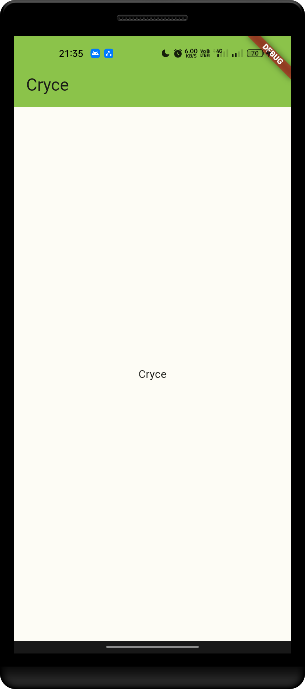

<!-- <p align="center">
  
</p> -->

<h1 align="center">Cryce</h1>

<p align="center">
  <a href="https://github.com/Golden-Tomini/Cryce/releases">
    
  </a>
</p>

<p align="center">
  Welcome to the Cryce repository! A multiplatform app, tackles food waste to support the 17 SDGs.
</p>

<h2 align="center">Meet the Teams</h2>

<table align="center">
  <tr>
    <td align="center">
      <a href="https://github.com/cabbbbsss">
        
      </a>
    </td>
    <td align="center">
      <a href="https://github.com/Malixl">
        
      </a>
    </td>
  </tr>

  <tr align="center">
    <td>Sabrina Salsabila Saleh<br/>(Hustler)</td>
    <td>Abdul Malik Matoha<br/>(Hipster)</td>
  </tr>

  <tr>
    <td align="center">
      <a href="https://github.com/cabbbbsss">
        
      </a>
      <a href="https://www.linkedin.com/in/sbrinaslsbla/">
        
      </a>
    </td>
    <td align="center">
      <a href="https://github.com/Malixl">
        
      </a>
      <a href="https://www.linkedin.com/in/abdul-malik-matoha-8aa454254/">
        
      </a>
    </td>
  </tr>
  <tr><td colspan="2"></td></tr>
  <tr>
    <td align="center">
      <a href="https://github.com/fauzan-radji">
        
      </a>
    </td>
    <td align="center">
      <a href="https://github.com/OnyanPokon">
        
      </a>
    </td>
  </tr>

  <tr align="center">
    <td>Tri Putra Fauzan H. Radji<br/>(Hacker)</td>
    <td>Mohamad Rafiq Daud<br/>(Hacker)</td>
  </tr>

  <tr>
    <td align="center">
      <a href="https://github.com/fauzan-radji">
        
      </a>
      <a href="https://www.linkedin.com/in/tri-putra-fauzan-h-radji-404810257/">
        
      </a>
    </td>
    <td align="center">
      <a href="https://github.com/OnyanPokon">
        
      </a>
      <a href="https://www.linkedin.com/in/mohamad-rafiq-daud-a58441248/">
        
      </a>
    </td>
  </tr>
</table>

## Features

_[To be added]_

## Screenshots

<p align="center">
  
</p>

## Getting Started

To get started with the Ingridentify Android App, follow these steps:

1. **Clone the Repository:**

   ```bash
   # SSH
   git clone git@github.com:Golden-Tomini/Cryce.git

   # HTTPS
   git clone https://github.com/Golden-Tomini/Cryce.git
   ```

2. **Run:**
   ```bash
    flutter run
   ```

## Issues

If you encounter any issues or have suggestions, feel free to open an issue on the [Issue Tracker](https://github.com/Golden-Tomini/Cryce/issues).

## Acknowledgments

We would like to express our gratitude to everyone contributing to this project. Together, we are making strides towards a sustainable living.
